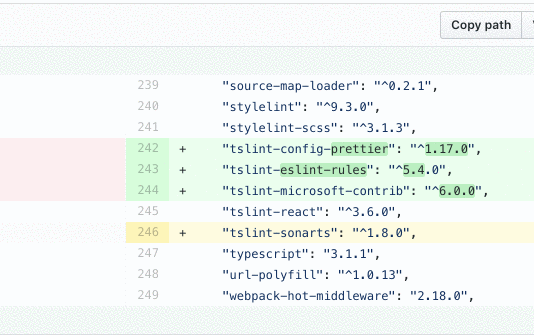

# Open Github in editor

A chrome and Firefox extension for opening github diff line in your editor 💻

https://chrome.google.com/webstore/detail/open-github-in-editor/epklehdbjbicoeeebecaeeeceflgpmga/

https://addons.mozilla.org/en-US/firefox/addon/open-github-in-editor/

- Supports vscode, vscode-insiders and textmate.
- More editors soon, maybe also support for gitlab who knows!!

## want support for sublime text?

follow this blocking issue https://github.com/SublimeTextIssues/Core/issues/2514

# Changelog

## v1.1.1

- fix for conversation tab support

## v1.1.0

- conversation tab lines support
- new icons

## v1.0.0

- Firefox support 🎉
- fixed annoying options page on chrome update
- fixed options reset on each update

## v0.1.0

- added support for textmate
- moved the changelog to readme

## v0.0.3

- add gif and some icons

## v0.0.2

- open options page on first run
- cleanup of the options page

## v0.0.1

- first version 🎉
